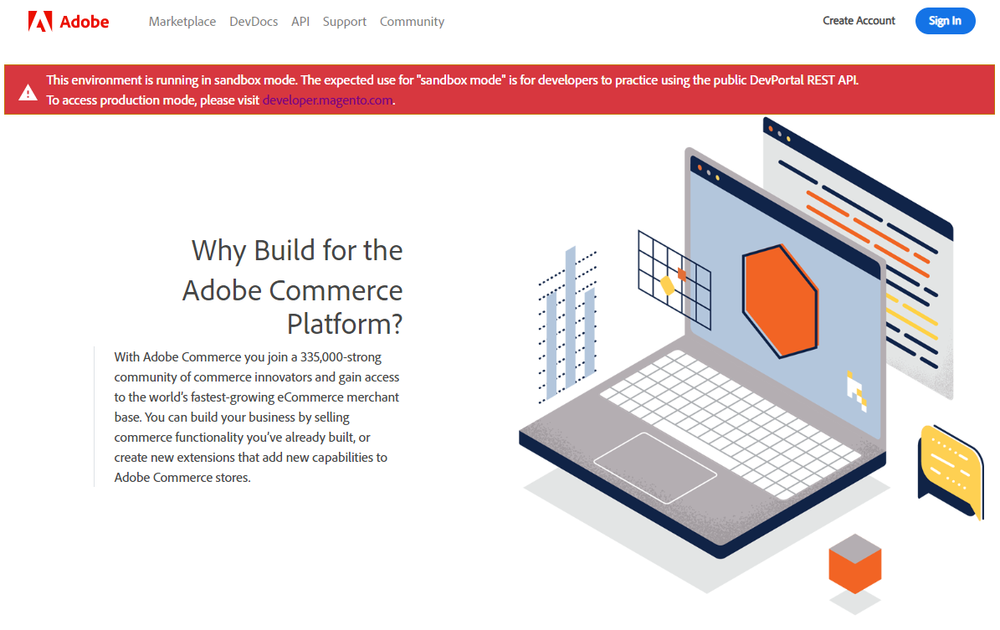

# Sandbox

<InlineAlert variant="info" slots="text"/>

Marketplace EQP API **access keys** generated in the [sandbox][2] environment are separate from those generated in [production][1].
You cannot use access keys from one environment in the other.
\<br/\>\<br/\>
**Session tokens** generated in the **sandbox** are separate from those generated in **production**.
You cannot use session tokens from one environment in the other.

The **sandbox** environment gives you an opportunity to practice using the **Marketplace EQP API** without any affect on your **production** items.

You can run CI/CD (continuous integration/continuous delivery) simulations on the **sandbox**.

## Differences between sandbox and production

The following list highlights some of the key differences between the sandbox and production environments:

-  No human reviews take place on the **sandbox**.
   -  Most, but not all, automated tools are run on your submissions. The [Copy/Paste Detector](test-results.md#copy-paste-detector) tool is not run.
   -  No technical QA reviews happen for your submissions.
   -  Only automated marketing reviews are run on your submissions.
-  There is no associated Commerce Marketplace store for the **sandbox**. As a result, the various [reports](reports.md) endpoints will typically return an empty set of data.
-  On the user interface, the **sandbox** is marked with a banner at the top of every page.
  

## Additional information

-  Regardless of the current state of your **user profile** on the **production** Marketplace Developer Portal, when you sign into the **sandbox** environment, you must rebuild your profile.
-  Marketplace EQP API [access keys](access-keys.md) in the **sandbox** are separate and distinct from **production**. You cannot use access keys from one environment in the other environment.
-  [Session tokens](auth.md#how-to-use-a-session-token) that are generated in the **sandbox** are separate and distinct from **production**. You cannot use session tokens from one environment in the other environment.
-  If you are on the same browser, when you logout of the [sandbox][2] you are simultaneously logged out of [production][1], and vice-versa.

[1]: https://commercedeveloper.adobe.com
[2]: https://commercedeveloper-sandbox.adobe.com
