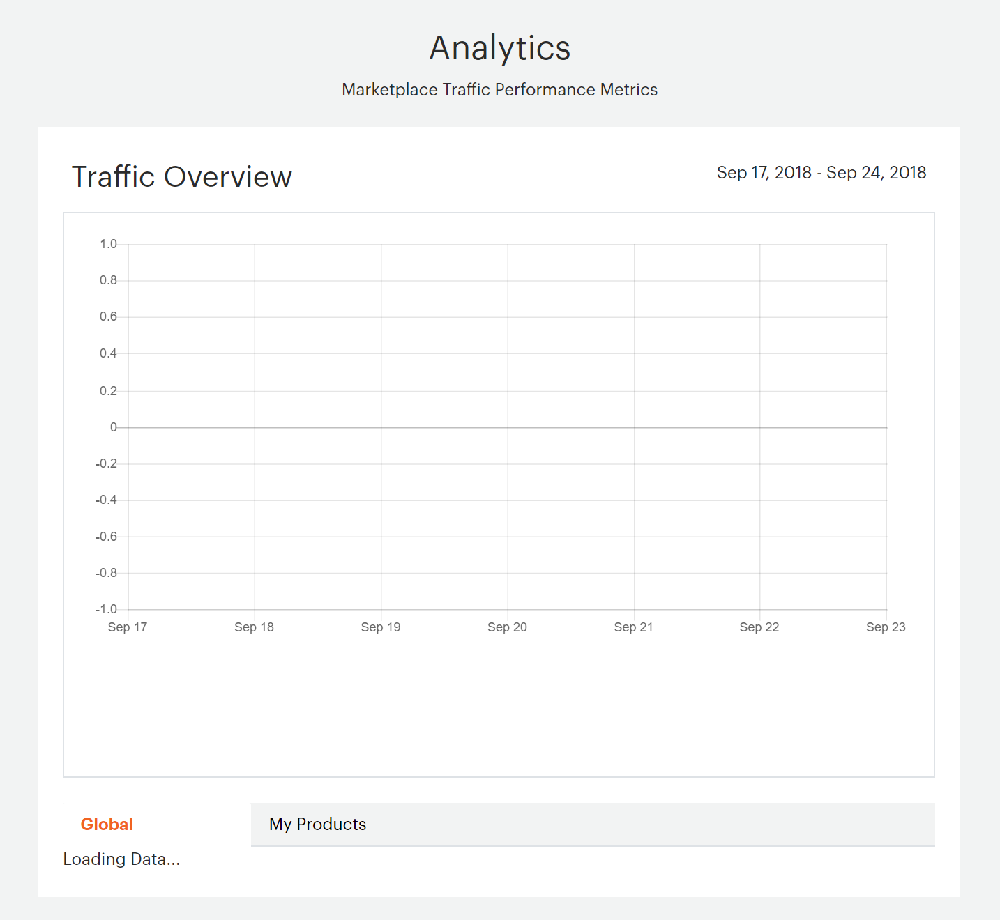

# Analytics

You can view data about the performance of your listings in the marketplace.

## View your performance data

In the top navigation of the Marketplace Developer portal, go to **Reports** >  **Analytics**.

## Traffic overview

|Field|Description|
|------|-----------|
|Global|Shows page hits for top-level categories for the last 7 days. Click an item on the table key to remove it from the graph or to add it back.|
|My Products|Shows page hits for your top five products. All products and their page hits are listed in the table below the graph. Click an item on the table key to remove it from the graph or to add it back.|
