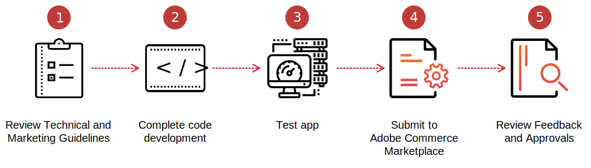

# Create an app

Before you can submit your app to Commerce Marketplace, the code must be complete, tested, and packaged. For technical information, see the [Adobe Developer App Builder](https://developer.adobe.com/app-builder/docs/overview/) for additional technical information for developing apps. The following guides provide additional information about the Adobe Commerce development environment:

-  [PHP Developer Guide](https://developer.adobe.com/commerce/php/development/)
-  [Best Practices for Extension Developers](https://developer.adobe.com/commerce/php/best-practices/)
-  [Magento Web APIs](https://developer.adobe.com/commerce/webapi/get-started/)
-  [Frontend Developer Guide](https://developer.adobe.com/commerce/frontend-core/guide/)

<InlineAlert variant="info" slots="text"/>

Commerce Marketplace does not support encrypted apps at this time.

## Build your app

1. Before submitting your app for Marketplace review, see the [Technical Review Guidelines](technical-review-guidelines.md) and the [Marketing Review Guidelines](marketing-review-guidelines.md).

1. Complete the development of your app.

1. Test your app. Testing your app in advance reduces the time it takes to pass Technical Review.

   <!---  Note to reviewer: For extensions, you used Codesniffer to check the code is compliant with the Commerce coding standards. I can't think of any specific testing to suggest for apps. Suggestions welcome. -->

1. Prepare, validate, and zip your app.

   <!---  Note to reviewer: As of right now, we're testing that the zip file contains an `install.yaml` and a package.json` file. It's not clear whether this is all that's needed. The "Create an extension topic" links to a PHP topic on Devdocs. If we come up with any requirements for apps, I'll put that info here until it can be moved to the Commerce Extensibility repo.  -->

1. Prepare the following preliminary documentation:

   -  Release notes in text format
   -  A user guide, installation guide, or reference manual in PDF format
