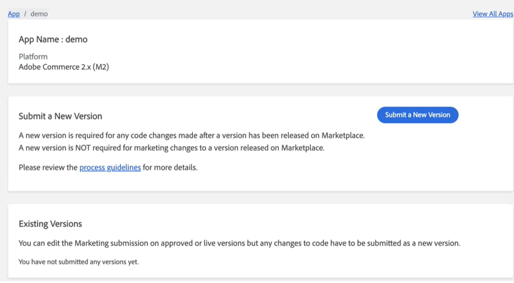
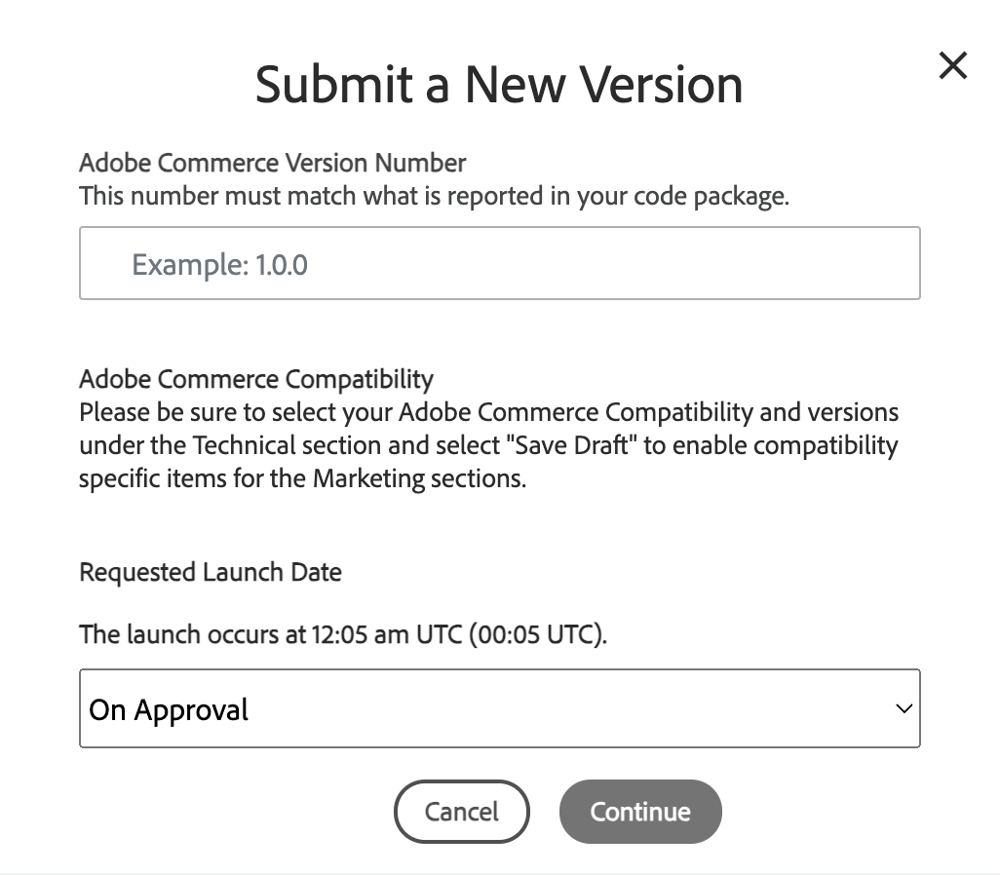

# Specify the version

After you [create the app entry](app-create.md), the next step is to specify and submit a new version. Apps can have multiple versions, including the first version submitted.

For existing, approved apps, follow these instructions to add new versions as available and released.

1. Log in to the Marketplace Developer Portal.

1. Click **Apps**, and then choose an app from the list.

1. Click **Submit a New Version**.

    

1. For **Marketplace Version Number**, enter a version number for the app as you want it to appear in the Marketplace listing. For example: 1.0.0.

1. Select the **Adobe Commerce Version Compatibility** checkboxes to specify which versions of Commerce your app supports.

    For **Requested Launch Date**, select an option:

    -  ***On Approval*** - Immediately publishes when the app receives Commerce Marketplace approval.
    -  ***Requested Launch Date*** - Date for launching and publishing the app to Marketplace. This date is not necessarily the date the product will launch; it is the earliest it can be launched, provided the product passes all reviews.

    

1. Click **Continue**.

You can continue with technical and marketing submissions, providing the code package, complete information, documentation, and more.

You can save progress and edit the app information as needed.
