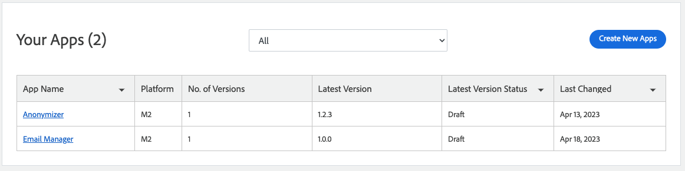

# Apps overview

The [Adobe Developer App Builder](https://developer.adobe.com/app-builder/docs/overview/) for Adobe Commerce enables developers to extend Adobe Commerce without modifying any core application code. This development environment reduces code complexity and lowers the costs of maintaining your solution.

Apps created with App Builder run out of process, meaning they run within the App Builder infrastructure, rather within an instance of Commerce. These apps must be written in Javascript, preferably Node.js. Therefore, the technical requirements and review for an app differs from an extension or other type of Marketplace listing. Some key difference include:

*  The app submitter must be associated with an Adobe enterprise or Adobe Commerce partner organization. Individuals and non-partner organizations cannot develop and submit App Builder apps.

*  Magento Open Source merchants cannot purchase apps.

*  Subscriptions are not currently supported for apps. Only one-time purchases are supported.

*  Adobe will waive any commission fees for a limited time on apps published to Commerce Marketplace in 2023.

Each submitted apps must still pass the technical and marking review process.

All apps submitted to Commerce Marketplace are managed from the Apps page in the Marketplace Developer Portal. This page shows the status of each app you have submitted, and provides access to the profile and version history of each. You can also use the workspace controls to sort and filter the list.

<TextBlock slots="image, heading, text, links" width="33%" />

## Build your app

Provides details on completing code, descriptions, documentation, and preparing to submit.

[Learn more](app-create.md)

<TextBlock slots="image, heading, text, links" width="33%" />

## Add information

Provides instructions for creating the initial entry for an app.

[Learn more](extension-information.md)

<TextBlock slots="image, heading, text, links" width="33%" />

## Specify the version

Provides instructions for adding new versions for an app entry.

[Learn more](extension-version.md)

| Column                | Description                                                                         |
|-----------------------|-------------------------------------------------------------------------------------|
| App Name        | The name of the app.                                                          |
| Platform              | Lists your products by platform. Options: Magento 2.x |
| No. of Versions       | The number of versions of the app that have been created.                     |
| Active Version        | The version of the app that is currently active.                              |
| Active Version Status | The current position of the app in the submission workflow.                   |
| Last Changed          | The date of the last change made to the version.                                    |
