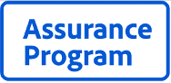

# App Assurance Program

With thousands of listings in the Adobe Commerce Marketplace, both merchants and developers face similar challenges:

- Merchants: How can I easily identify high-quality apps and extensions that fit my business needs?
- Developers: How can I ensure my solutions are built according to customer expectations while also achieving better visibility for my innovations?

To address these challenges, Adobe created the App Assurance Program, which benefits merchants and developers alike. The App Assurance Program evaluates the quality of apps and extensions to ensure they meet Adobe's high standards. Merchants can now easily access a curated collection of listings that have passed a higher standard and are built with scale and performance in mind.

## Benefits for Merchants

**Curated Excellence**: Say goodbye to endless searching. Access a carefully selected range of apps and extensions that meet Adobe's strict quality criteria. Feel confident in choosing solutions that align with your business needs and are tailored for mid-market and enterprise use.

**Scalability and Performance**: Rest assured, each app and extension are meticulously designed for top-notch scalability and performance, seamlessly integrating into your Commerce setup and operations.

**Elevated Quality**: Be confident that every program extension and app meets and exceeds our rigorous standards that were meticulously crafted with scalability and performance in mind. Apps and extensions are tested with each other and Adobe Commerce to ensure interoperability.

## Benefits for Developers

**Amplify Your Visibility**: Struggling to make your products shine in the bustling marketplace? Our App Assurance Program ensures your extension/app gets noticed by offering prime placement. Benefit from enhanced exposure through exclusive placement and specialized search filters within the Marketplace for apps and extensions.

**Quality Assurance**: Display your unwavering commitment to quality with an App Assurance verified badge for your listing on the Commerce Marketplace, building trust and credibility with potential users.

**Performance Enhancement**: Benefit from technical consultation and the code review process, which enhances the longevity, interoperability, and enterprise-level performance of your extensions and apps.

## Review process

After passing our [Extension Quality Program](./extension-quality-program.md), submissions to the App Assurance Program undergo a thorough code review, Magento Functional Testing Framework (MFTF) testing, and performance testing.

The following sections describe each step of the verification process.

### Code review

The enhanced code review consists of a static code review and a security code review. The static code review consists of the following:

- Review the code for any bugs
- Validate that the submission adheres to the [Adobe Commerce coding standard](https://github.com/magento/magento-coding-standard)
- Validate the change level against the level submitted by the developer
- Check dependencies for any known vulnerabilities
- Confirm that the listing is compatible with the newest version of Adobe Commerce

The security code review consists of the following:

- Check for outdated frameworks with known vulnerabilities
- Check for SQL injection and data sanitization issues
- Check databases for proper structure
- Ensure proper use of classes and methods

### Interoperability

Interoperability testing is a systematic quality assurance process included in the App Assurance Program. It involves testing the compatibility and seamless interaction of the participating third-party extensions/apps with the Adobe Commerce platform. The goal is to ensure that these extensions and apps work seamlessly together, avoiding conflicts or disruptions to the overall system's functionality. This rigorous testing process helps maintain a stable software ecosystem by verifying that extensions/apps do not negatively impact each other or the core Commerce platform.

To ensure multiple extensions/apps are compatible, we install them together and run a combination of included and Commerce core tests. If there are any test failures observed, we will isolate them and proceed with identifying any incompatibility issues.

### Functional Testing Framework testing

The [Functional Testing Framework](https://developer.adobe.com/commerce/testing/functional-testing-framework/) tests help assess the critical functionality of a listing within Adobe Commerce. Participating developers must provide a test suite that includes a smoke test of their submission. Developers should also consider providing end-to-end tests that cover the core functionality of their submission. These submitted tests are used extensively in the review process for the App Assurance Program.

### Performance testing

Performance testing helps to identify bottlenecks and scalability issues by utilizing the submission along with simulated data and real-world activities. These tests help developers understand the product's capabilities and identify improvement areas to maintain high-performance standards.

Listings only pass the performance testing step if they have a low rate of errors and degradation.
