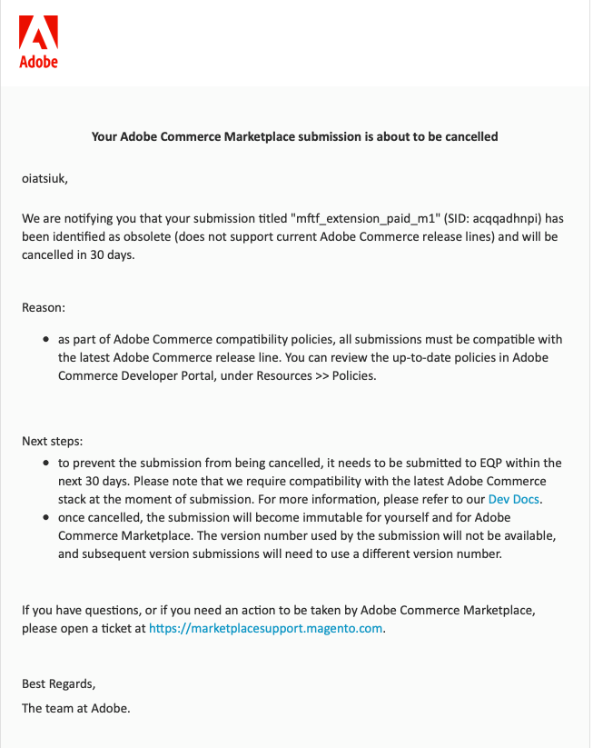
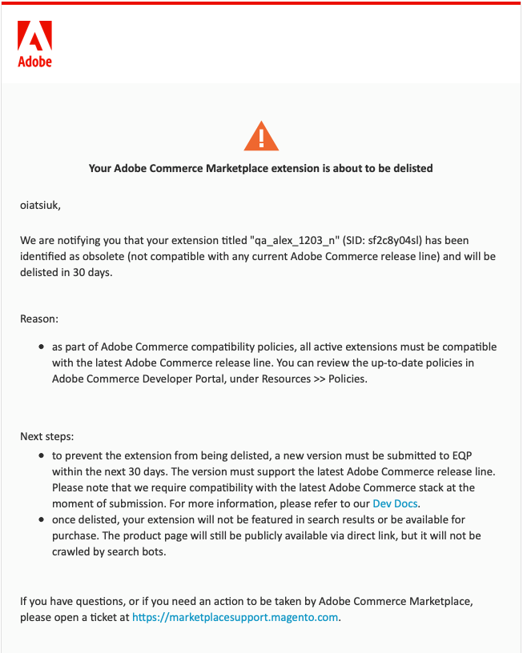

# Obsolete listings

As the Magento Open Source and Adobe Commerce technology moves forward, release lines get marked as End of Life (EOL) and deprecated.

We call listings that are only compatible with deprecated (EOL) release lines "obsolete listings".

Monthly automated checks are performed to identify listings that only support EOL release lines and notify the developers that they are required to submit a version compatible with the latest release line.

There is a 30-day window to submit a compatible version; otherwise the listing is removed from the Marketplace.

If a compatible version is submitted through the Developer Portal and passes EQP tests and Marketing review, the listing is restored.

## Example notifications

See the following example notification for cancelling an obsolete listing:

See the following example notification for delisting an obsolete listing:

