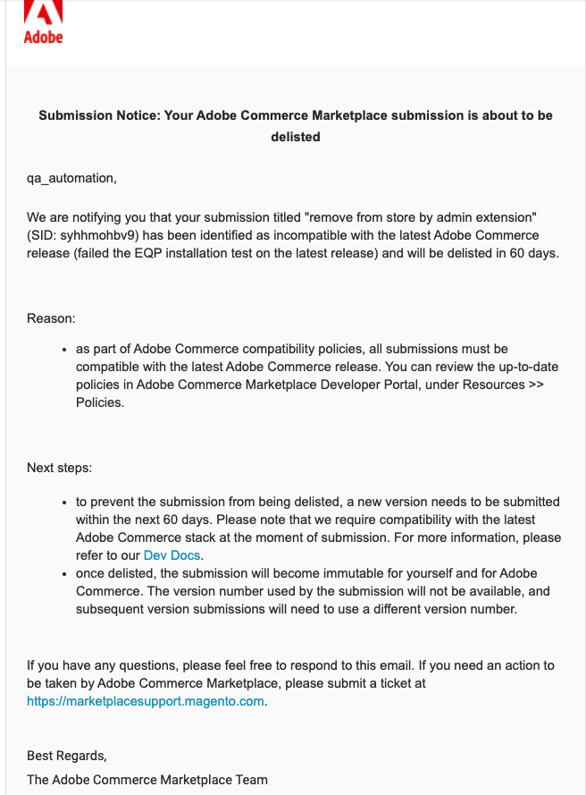

# Release compatibility

<InlineAlert variant="info" slots="text" />

This topic is applicable for extensions and themes only.

A key factor for merchants' Total Cost of Ownership (TCO) is having their listings (extensions and themes) up-to-date and available for seamless upgrades to the latest version of Adobe Commerce or Magento Open Source. To best serve this need, our goal is to proactively monitor and eliminate listings that are out-of-date, out of compatibility with supported release lines, or have been otherwise abandoned. Therefore, we are updating our policies to clearly state certain requirements for version compatibility and frequency of updates:

1. Every listing must be compatible with a supported release line in order for the SKU to remain searchable and available for purchase.
1. After every minor (2.x.0) release, listings have 60 days to submit a compatible version, otherwise they will be delisted.
1. After every patch (2.x.y) release, developers have 30 days to submit a compatible version. Listings that do not pass EQP tests on a new patch release after 30 days will be delisted.
1. The product pages of delisted products will remain accessible by direct link. The listings will remain downloadable from `repo.magento.com`, but won't be found in search results or Catalog pages.

To minimize the amount of manual maintenance associated with this new rule, existing EQP tests are automatically executed when the new patch release is available. Listings that pass these tests are marked as compatible with the new patch release and no action is required.

If a listing fails the tests, the developer receives an email notification instructing them to supply a new version within 30 days. If you receive such a notification, just re-submit a new version to Marketplace, ensuring it was tested against the latest patch version using the Cloud Docker environment.

## Example notification

See the following example notification:

