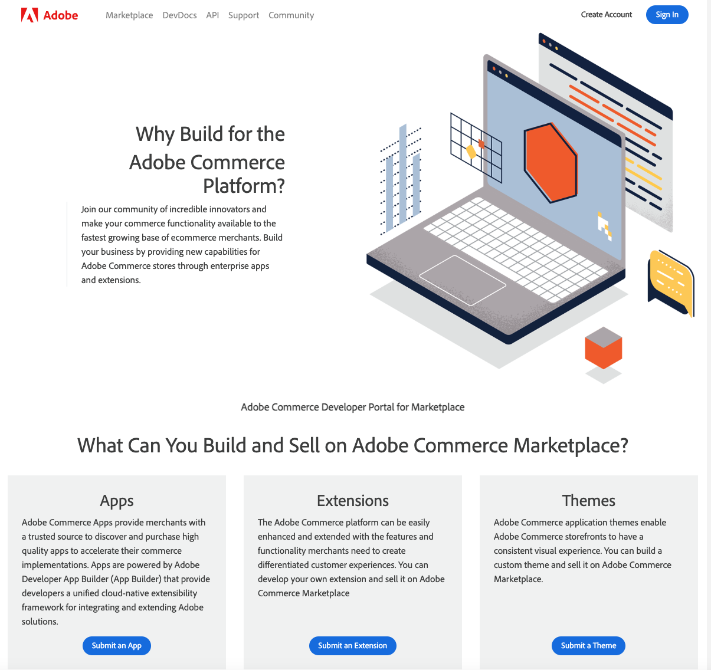

# Developer Portal Overview

From the Developer Portal you can access your product submissions and reports, as well as Marketplace support information and coding guidelines.

Once you're logged in, these menus appear at the top of portal front page.

|Menu item|Description|
|--- |--- |
|[Apps](apps.md)|Takes you to the Your Apps page.|
|[Extensions](extensions.md)|Takes you to the Your Extensions page.|
|[Themes](themes.md)|Takes you to the Your Themes page.|
|[Shared Packages](shared-packages.md)|Takes you to the Your Shared Packages page.|
|[Reports](sales.md)|[Sales](sales.md) - Takes you to your Sales reports. [Analytics](analytics.md) - Takes you to your sales Analytics reports.|
|Resources|Lists policy information and provides links to the documentation.|
|[Support](https://commercemarketplace-support.adobe.com/hc/en-us)|Opens the [Commerce Marketplace Help Center](https://commercemarketplace-support.adobe.com/hc/en-us).|
|Community|Links to the Adobe Developer [Magento Open Source](https://developer.adobe.com/open/magento) page. |
|[Profile Information](profile-information.md)|Account Information Marketplace Profile Sign Out|
