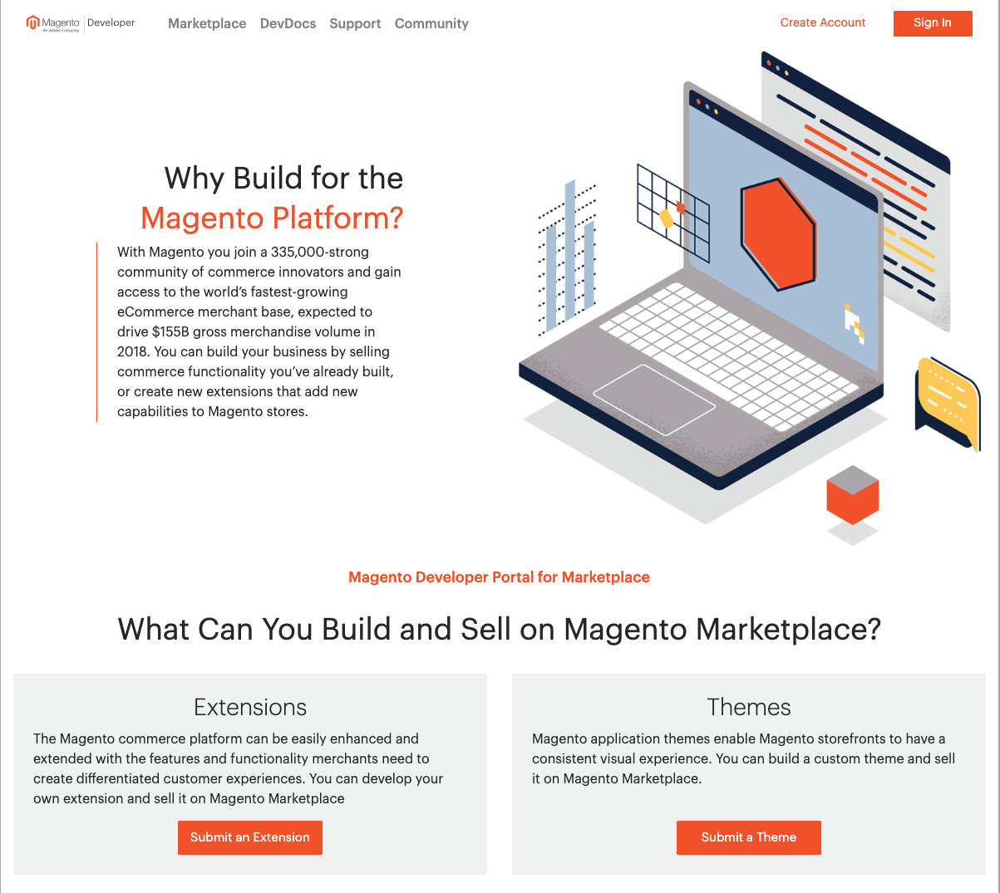

# Register as a developer

Follow these steps to create a new developer account, or to register as a developer with your existing Magento account.

## Step 1: Create a developer account

1. Access your account.

   If you don't yet have a Magento account, do one of the following:

   -  Go to the [Developer Portal](https://developer.magento.com) page, and click **Create  Account**. Then, click **Register**.
   -  In the upper-right corner of [Commerce Marketplace](https://marketplace.magento.com), click **Sign In**. Then, click **Register**.
   -  From [magento.com](https://magento.com), click **My Account**. Then under **New Customers**, click **Register**.

   If you already have an account, log in as a registered user.

   1. Click **Marketplace** and choose **Developer Portal**.

   1. Under _Personal Information_, enter your **First Name**, **Last Name**, **Email Address**, and **Country**.

      If there is already an account associated with this email address, click the link to access your account.

   1. Under _My Company Primarily_, choose the best description of your company's primary focus. Then, set **My Role** to the option that best describes what you do for the company.

   1. Under _Login Information_, enter a **Password** for your account. Then, enter it again to confirm.

      Your password can be from eight- to sixteen-characters long, and must include at least one capital letter, one number, and either one special character or one lowercase letter.

   1. Select the **Terms of Service** checkbox and click **Submit**.

## Step 2: Agree to the terms of service

Read the following documents that describe Commerce Marketplace [terms of service](https://magento.com/legal/terms/marketplace-xcelerate).

-  Xcelerate & Marketplace Master Terms
-  Xcelerate & Marketplace Development Terms

For your reference, you can also find these documents on [magento.com](https://magento.com/legal/terms/marketplace-xcelerate).

If you agree with the terms of use, select the checkbox and click **I Agree**.

## Step 3: Select the type of account

Your Commerce Marketplace developer account can be set up as an individual or company. All listings that are developed by a single company should be managed under the same account.

When prompted, select the type of account you want to create, and click **Choose**. Then, follow the appropriate instructions to complete the profile for the account.

-  [Business Account](profile-company.md)
-  [Individual Account](profile-personal.md)

