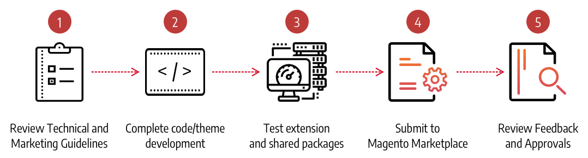

# Create an extension

Before you can submit your extension to Commerce Marketplace, the code must be complete, tested, and packaged. For technical information, see the Magento DevDocs for additional technical information for developing extensions and more:

-  [PHP Developer Guide](https://devdocs.magento.com/guides/v2.4/extension-dev-guide/bk-extension-dev-guide.html)
-  [Best Practices for Extension Developers](https://devdocs.magento.com/guides/v2.4/ext-best-practices/bk-ext-best-practices.html)
-  [Magento Web APIs](https://devdocs.magento.com/guides/v2.4/get-started/bk-get-started-api.html)
-  [Frontend Developer Guide](https://devdocs.magento.com/guides/v2.4/frontend-dev-guide/bk-frontend-dev-guide.html)

<InlineAlert variant="info" slots="text"/>

Commerce Marketplace does not support encrypted extensions at this time.

## Build your extension

1. Before submitting your extension for Marketplace review, see the [Technical Review Guidelines](technical-review-guidelines.md) and the [Marketing Review Guidelines](marketing-review-guidelines.md).

1. Use the [CodeSniffer](https://github.com/squizlabs/PHP_CodeSniffer) tool to verify that your code meets Marketplace guidelines.

   Testing your extension in advance reduces the time it takes to pass Technical Review. For a list of code sniffer rules, see [Magento Extension Quality Program Coding Standard](https://github.com/magento/marketplace-eqp).

1. Prepare, validate, and zip your extension as described in [Packaging a Component](https://devdocs.magento.com/guides/v2.4/extension-dev-guide/package/package_module.html).

1. Prepare the following preliminary documentation:

   -  Release notes in text format
   -  A user guide, installation guide, or reference manual in PDF format
