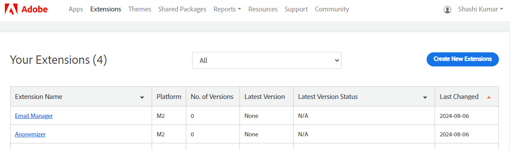

# Prepare your product for submission

<InlineAlert variant="success" slots="text" />

Unless otherwise indicated, these steps apply to all types of listings (apps, extensions, themes, and shared libraries).

If your organization is not recognized as an Adobe partner, the **Apps** menu displays the following screen.

When your code is complete, the next step is to add an entry for your product to Commerce Marketplace. This creates an entry in the Commerce Marketplace Developer portal, but does not submit the listing.

To add a listing, you need to complete these instructions, then submit the [version](extension-version.md).

## Create a new entry

1. Log into the Marketplace [Developer Portal](developer-portal.md).

1. Click **Apps**, **Extensions**, **Themes**, or **Shared Packages** in the top navigation. This example demonstrates creating an entry for an extension.

   A page displays any existing listings you have previously added.

   

1. Click **Create New _Listing-type_**, for example, **Create New Extension**.

   The displayed chart provides a high-level overview for creating and submitting extensions. The chart is the same for all apps, extensions, and themes. This chart is not displayed for shared packages.

   

1. Complete the basic information necessary for creating an entry. We recommend entering all content in English. For additional content details, see detailed field descriptions and [Listing content](content.md).

   The following table lists the available fields for each listing type.

   | Field name | Supported listing types | Description |
   | --- | --- | --- |
   | **Title** | All |  The name or title of the listing. Duplicate names are not allowed. |
   | **Adobe Commerce Platform Version** | All | You must select **Adobe Commerce 2.x (M2)**. You can select the specific minor versions during submission. |
   | **How would you like to sell your Product?** | Extensions, themes | The pricing model for the listing. **One time** indicates buyers pay one flat fee. **Subscription** indicates buyers will be charged an auto-renewable price for your extension or theme. Apps support one-time purchases only. |
   | **Does this extension enable an integration with a non-Adobe Commerce service?** | Extensions | Indicate if the extension enables integration with other services not part of Adobe Commerce. If you select **Yes**, enter information for those services.  **Name of Service** - The name of the non-Adobe service.  **URL of Service** - The full URL for website of the non-Adobe service. **Is this service owned/operated by you or a 3rd party** - Indicate if you run this service, or another third party. **Does this Service require additional subscription payments to the 3rd party** - Indicate if the service requires additional payments and costs to use the extension. You must to provide this information during submissions for pricing. **Are subscription payments ALSO required to your company for the integration** - Indicate if additional subscription costs are required for the integration. You must provide this information during submissions for pricing. |

1. When complete, click **Submit and Continue**.

   The Details screen displays information about your entry, including any existing versions.

1. To continue the submission process, click **[Submit a New Version](submit-for-review.md)**.
