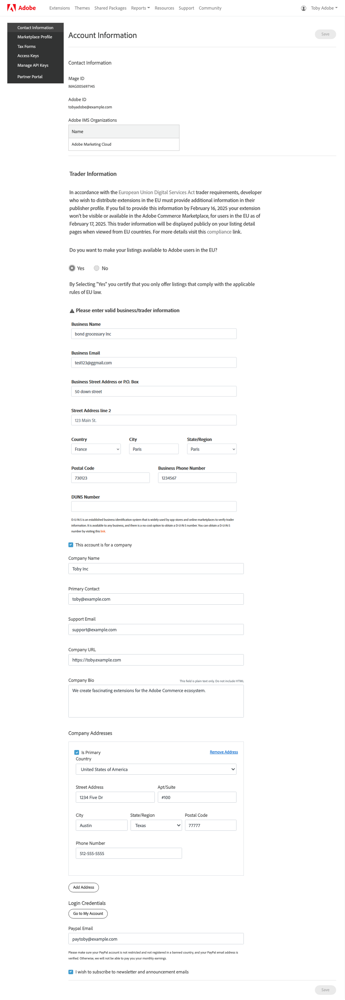

# Profile information

Your profile tracks and provides all information for your Marketplace Developer Portal account, including company information, payment account information, access keys, tax forms, and partner information.

## Contact info

Your contact information shows your Mage ID, your Adobe ID, and any Adobe IMS organizations you are currently associated with per your login.
Your contact information also includes your address, phone number, and PayPal email address. As part of the registration process, you must enter a valid PayPal email, even if your extensions are available for free on Commerce Marketplace. Adobe Commerce sends your revenue share payment to your PayPal account.

### Account information

|Field|Description|
|--- |--- |
|Personal URL|(Optional if using your company profile) The URL for your personal website.|
|Personal Bio|(Optional if using your company profile) Information about yourself.|
|Personal Addresses|At least one address is required; you can enter up to three. If there are multiple addresses, you must designate one as the primary contact address.|
|Login Credentials|Clicking **Go to My Account** takes you to your Adobe Commerce account information.|
|PayPal Email|You must enter a valid PayPal account email, even if  your extensions are available for free on Commerce Marketplace. Adobe Commerce sends your revenue share payment to your PayPal account.|

### Company

|Field|Description|
|--- |--- |
|Company Name|Your company name appears in your Marketplace profile, and as a link to your company profile in all of your extension listings.|
|Primary Contact|The name of the main point of contact at your company.|
|Support Email|The email address for your company's support contact.|
|Company URL|The URL for your company website.|
|Company Bio|Your company bio helps prospective buyers get acquainted with your company background and areas of expertise. Max characters 1500 words or less.|
|Company Addresses|At least one address is required. You can enter up to three. If there are multiple addresses, you must designate one as the primary contact address.|
|Login Credentials|Clicking **Go to My Account** takes you to your Adobe Commerce account information.|
|PayPal Email|You must enter a valid PayPal account email, even if your extensions are available for free on Commerce Marketplace. Adobe Commerce sends your revenue share payment to your PayPal account.|

## Access keys

Commerce Marketplace uses a pair of public and private 32-character tokens to authenticate access to the repository of third-party extensions and themes. You can create multiple sets of access keys for others who install extensions for your store. Marketplace access keys can be generated, disabled or enabled, and deleted from your account.

If you have at least one Adobe organization associated with your account, you can access keys associated with your Mage ID ("Myself") and/or have access keeys associated with each of your Adobe organizations.
Access keys associated with an Adobe organization are shared between all members of this organization.

<InlineAlert variant="info" slots="text"/>

The access key pair that is generated for Marketplace is not the same as the [Encryption Key](https://docs.magento.com/user-guide/system/encryption-key.html) that is associated with the Magento 2.x setup.

For more technical information, see [Get your authentication keys](https://devdocs.magento.com/guides/v2.3/install-gde/prereq/connect-auth.html).

### Create a new access key

1. Click **Create New Access Key**. Then, do the following:

    1. In the Basic Access Key Information dialog, if you have at least one Adobe organization associated with your account, choose which group to create this access key for.
       1. The "Myself" selection will associate this access key to your Mage ID.
       2. If you have no selections present, then this access key will be associated with your Mage ID.
    2. Enter an **Access Key Name** (max of 32 characters) to identify the access key.
    3. Click **Continue**.

    

    Your new access key appears in the list, and can now be used to authorize downloads of Adobe Commerce updates, extensions, and themes.

    

## Marketplace profile

Your Marketplace Profile contains information you entered during account setup, lets you enter social media links, and gives you the option to upgrade your partner status.

### Account information

| Field | Description |
|-------|-------------|
| Screen Name | Entered when you created your Marketplace Developer account. |
| Vendor Name | Entered when you created your Marketplace Developer account. |
| User Email | Entered when you created your Marketplace Developer account. |
| Logo | A profile photo (for personal accounts) or a company logo (for company accounts). |
| Partner Status | Your current partner status is displayed. Clicking **Upgrade Partner Status** takes you to the [Become a Partner](https://magento.com/partners/become) page. |
| Privacy Policy URL | The URL of your company\'s privacy policy website. |
| Other Options | Add links to various social media profiles. |

## Tax forms

Marketplace policy requires all providers to submit business information to ensure the efficient processing of transactions and payments. Here you can download the necessary form for your tax status, and click **Email Tax Forms** to open an email in your default email client.

## Partner portal

Click **Partner Portal** to open the Adobe Commerce Partner Portal dashboard.

