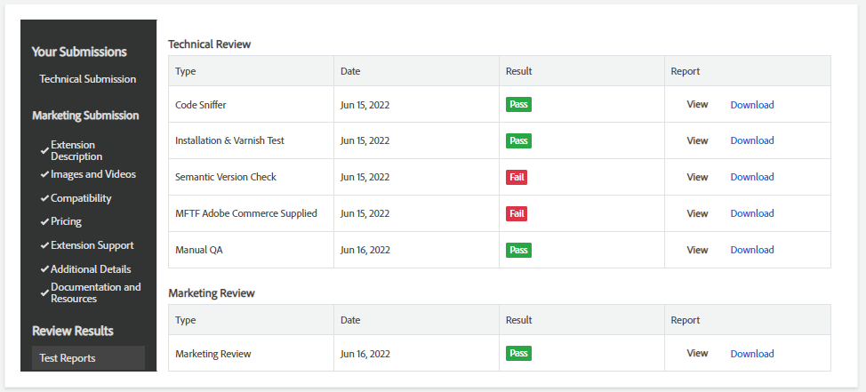

# View the results overview

When the review is complete, a link to the resulting report is provided for the listing that was submitted for review. Test results will also be communicated via email.

The report includes the results of the following tests:

-  Code Sniffer
-  Copy Paste Detector (CPD)
-  Installation and Varnish
-  Manual QA Review
-  Marketing Review

## View the results of the review

1. To view the results of the tests, navigate to the product's status page.

1. Under _**_Review Results_, click **Test Reports**.

1. In the Report column, do one of the following:

    -  Click **View** to view the report results in a popup window.
    -  Click **Download** to download the report as a JSON file.

    

## Troubleshooting

This section provides troubleshooting tips for common issues.

### Package stability

The following error message means that you are using an `alpha` value for the package, which is not supported, and cannot be installed on the Commerce platform:

```text
Stability is not valid. Allowed values are: "stable, beta".
```

To resolve this issue, change the stability value to `stable` or `beta` in the `package.xml` file under `stability`.
