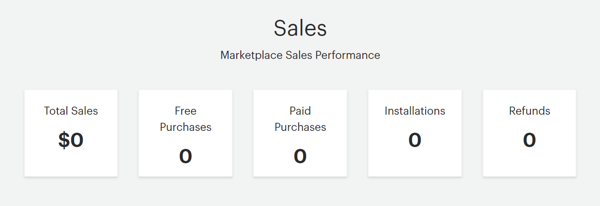

# Manage sales overview

Commerce Marketplace is a full-featured digital commerce site with integrated payments, where you can offer your products for free, or for sale. Purchases can be paid by credit card or PayPal.

Developers are not charged a fee to submit or list products or services on Commerce Marketplace. All product sales are subject to a [revenue share](revenue-share.md), with 85% of the revenue for the developer, and 15% for Adobe. This business model allows us to invest in marketing and promotions to grow the businesses of participating developers.

<InlineAlert variant="info" slots="text"/>

Adobe is waiving commission fees on Adobe Commerce Marketplace (formerly known as Magento Marketplace) for sales of applications built using Adobe Developer App Builder ("Apps") and submitted via Adobe's Developer Portal in 2023. Adobe will waive commission for two (2) years from the date that an App is listed on Adobe Commerce Marketplace. The App commission waiver terms will be included in the Developer Portal.

Adobe reserves the right to charge commission on sales of Apps submitted after 2023. Adobe will communicate the commission model for Apps submitted outside of 2023 at a later date.

Buyers have twenty-five (25) days after the date of purchase to request a refund. Adobe Commerce reviews all refund requests and if approved, issues the appropriate refund.

## General developer payout information

The developer payout is 60 days after the end of the month and must exceed $100. For example, January sales (minus the revenue share) would be distributed on or around the first of April. If the amount does not exceed $100, then the outstanding amount is rolled over to the next payout date until the amount exceeds $100. Additional requirements for receiving a payout include:

- The extension must have a minimum price of $25 or more.
- You must provide a tax form or confirm the 30/70 split of revenue to cover taxes. If Adobe has not processed the taxes for your account, you will not receive a developer payout regardless of the developer revenue amount.
- A PayPal account is required to receive the developer payout and is the only method that the Adobe Commerce Marketplace currently uses to transfer payout funds. Adobe cannot accommodate countries that do not have PayPal at this time.

For more information, see the _Marketplace Earnings_ section in the [developer agreement](https://magento.com/legal/terms/marketplace-xcelerate-master).

## Customer information

Protecting the privacy of customer information is important to Adobe, and we work to ensure that our policies meet industry-standard privacy practices. We also recognize your need to communicate with those who purchase your products and services.

At the time of transaction, you will receive an email notification that identifies the customer by user name, and lists each app, extension, or theme purchased, along with any additional installation or support services.

-  Customers who purchase installation or support services receive your support contact information at the time of purchase.
-  Customers who do not purchase additional services can communicate directly with you using the general contact information on your profile page.
-  SaaS providers can provision license keys for customers after the purchase.

## View your sales information

Sales and refund information is available in your Marketplace dashboard, and it is also sent by email.

Subscription payments are displayed as individual transactions.

In the Marketplace Developer portal, in the top navigation, go to **Reports** > **Sales**.

| Field | Description |
|--- |--- |
| Total Sales | The total dollar amount of all of your sales on Marketplace. |
| Free Purchases | The number of free products you have transacted. |
| Paid Purchases | The number of paid products you have transacted. |
| Installations | The number of your products that have been installed. |
| Refunds | Commerce Marketplace allows buyers up to 25 days after the date of purchase to request a refund. Requests for refunds are reviewed by the Commerce Marketplace administrator. If approved, credited to the PayPal account of the purchaser. |

|Tab|Description|
|--- |--- |
|Sales|Lists all sales of products, installation, and support across the lifetime of the account.|
|Refunds|Lists all refund requests along with their statuses (i.e., approved, declined, or pending).|
|Payouts|Lists all payouts you've received.|
