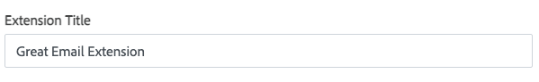

# Submit for marketing review overview

When you have completed the code, you can submit your app or extension for marketing review. You can submit your product for both technical and marketing review at the same time. The review process is the same for all listing types.

Your submission is immediately placed in a queue. You will receive confirmation by email, and can track the status of your submission from your Marketplace account.

During marketing review, your submission is examined to ensure that it meets Marketplace requirements for presentation, content, and branding. Before granting approval, we read, review, and determine the quality of the marketing content for your extension according to our [marketing guidelines](marketing-review-guidelines.md).

## Prepare for marketing review

Before submitting an item for marketing review, conduct your own internal review of the content to make sure that it is ready for publication.

-  Review the marketing guidelines to ensure that your extension meets Commerce Marketplace and all development requirements.
-  Spell-check and review all text fields in your request, product documentation, and marketing materials.
-  Read the text out loud to make sure that the tone is conversational, and with no missing or transposed words.
-  Get a second opinion. Ask a friend or colleague to review the profile, screenshots, and any supplemental documentation.
-  Consider the following: Is the presentation professional? Does it foster confidence in your skills as a developer? Does it have commercial appeal? Do you provide information to help customers understand your product and how it supports their storefronts and backend?

## Submit for review

1. Log into the Marketplace Developer Portal, and then click **Apps**, **Extensions**, **Themes**, or **Shared Packages**.

1. Click the item name you want to submit.

   The **Technical Submission** page loads.

1. Click one of the entries under **Marketing Submission** to add marketing content.

    As you complete sections, a checkmark displays tracking progress. If you updated or submitted content for the **Technical Submission**, the list displays checkmarks for that submitted content.

    

1. Complete each section and submit for review when it is complete.

    -  Click **Save Submit** to save progress.
    -  Click **Preview** to see the output of your marketing information.
    -  After adding all content, with full checkmarks across sections, click **Submit**.

### Listing description

1. Under **Marketing Submission**, click **Description**.

    The **Title** is pulled in from the basic [information](extension-information.md). You can edit this field.

    

1. Enter a **Long Description** about your listing, including features and functionality.

    Use formatting buttons and options to highlight information, features, and more. Maximum characters: 25,989

    

1. For the **Category**, select the **Main Category** for your extension and up to three **Subcategories**.

    These settings determine how your product is listed on Marketplace.

    

### Images and videos

You must provide a thumbnail and at least two high-quality images for the image gallery that depict the listing. The Product Thumbnail represents your product in the listings. In addition, you can upload up to fifteen Product Images. Make sure to include only relevant information, and crop the image to remove the URL and any unnecessary white space. Images can be in either JPG (JPEG) or PNG format, with a maximum file size of 5 MB for each.

1. Under **Marketing Submission**, click **Images and Videos**.

1. (Required) For **Icon**, click **Upload Icon** to upload an icon file to assign to your extension.

    

1. (Required) For **Images**, click **Upload Gallery Image**.

   Your listing must have at least two gallery images. For more information about using images, see [Image Tips](image-tips.md).

    

1. (Optional) Under **Video Links**, paste the URLs of any YouTube videos to include with your extension.

    For more information about using videos, see [Video Tips](video-tips.md).

    

### Compatibility information

1. Under **Marketing Submission**, click **Compatibility**.

    The information displayed here is pulled from what you entered in the basic [extension information](extension-information.md) or technical submission. To modify the version compatibility, see [Submit for Technical Review](submit-for-technical-review.md).

1. For **Browser Selection**, select the checkboxes for browsers compatible with your extension.

    

### Pricing information

1. Under **Marketing Submission**, click **Pricing**.

1. For **Adobe Commerce \[Version\] Price**, enter the price for each edition supported in U. S. currency. If the extension will be available for free, leave the default price of zero.

    

1. If you offer installation services, select the **Yes, I want to sell installation...** checkbox and enter an **Installation Price**.

    

### Support (optional)

Customers are advised to contact you directly for support, using the information that you provide. For support issues related to Commerce Marketplace, see the [Help Center](https://marketplacesupport.magento.com/hc/en-us).

1. Under **Marketing Submission**, click **Support**.

1. If you offer support services, select the **Yes, I want to sell support...** checkbox and complete the **Support Tier 1** pricing.

1. Choose the number of months in the contract according to the tier level, and enter the price.

1. To add an additional tier, click **Add Support Tier**. You can offer up to three pricing tiers for your support services.

    

### Additional details

1. On the listing status page, on the left side, under **Marketing Submission**, click **Additional Details**.

1. Choose the **Stability** setting that applies to this version of the extension:

    -  Beta Build: Internal testing is complete, and the listing is released to the public to help identify any outstanding issues.
    -  Stable Build: Any major issues found during the beta release stage have been resolved, and the listing is ready for market.

1. Under **Other Options**, select checkboxes for each applicable option.

    -  Released with setup scripts
    -  Service contracts included
    -  External service contracts included
    -  Custom UI implementation
    -  Web API supported
    -  Test coverage supported
    -  Responsive design supported

    

### Documentation and resources

<InlineAlert variant="info" slots="text"/>

While you can add documentation PDF files during this review, the content is tested during the [technical review](submit-for-technical-review.md).

1. On the listing status page, on the left side, under **Marketing Submission**, click **Documentation and Resources**.

1. If you did not upload documentation during the technical submission process, you can upload it here. Click the relevant button and navigate to the file you want to upload. App and extension submissions require at least one supporting document.

    

## What happens next?

If you have not submitted the [technical review](submit-for-technical-review.md), complete those steps to submission.

Watch your email for feedback and updates for the marketing review.

If issues, errors, or changes are required, you will receive an email failure notification. The submission will be in a failed state. When those issues are resolved, re-submit the listing for review.
