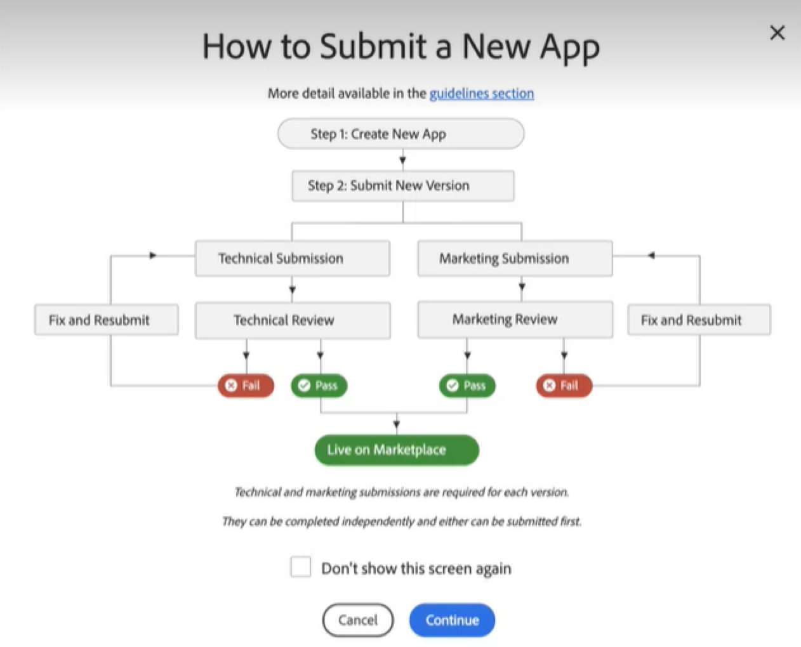

# Review process overview

After completing development, testing, and creating a new entry, you can submit your product for [Technical](submit-for-technical-review.md) and [Marketing](submit-for-marketing-review.md) review. The product enters a queue when submitted. We will review your code and submitted information according to the queue, sending feedback and confirmation by email. Track the status and progress of your submission through your Marketplace account. Our [Extension Quality Program](extension-quality-program.md) (EQP) verifies that all Marketplace submissions meet Adobe Commerce quality standards and best practices.

<InlineAlert variant="info" slots="text"/>

Before submitting your product for review, [complete the information](extension-information.md) about the product through the [Developer Portal](developer-portal.md).

The submission process requires you to do the following:

-  Review and agree to the Terms and Conditions of Commerce Marketplace.
-  Pass both technical and marketing review.
-  Provide information about your business to ensure that transactions and payments are processed efficiently. This information includes W-8 / W-9 forms, as required by law. For more information, see the [technical](technical-review-guidelines.md) and [marketing](marketing-review-guidelines.md) review guidelines.

You can submit your product for [technical review](submit-for-technical-review.md) when you are ready to have Commerce Marketplace review the code and technical aspects of your submission. These steps require additional information, including a PDF guide, supported Commerce versions, and code package.

You can submit your product for [marketing review](submit-for-marketing-review.md) as soon as your marketing content is ready for review.

You must complete both the technical and marketing review to fully list your product on the Commerce Marketplace. The following diagram details the submission and review process.

