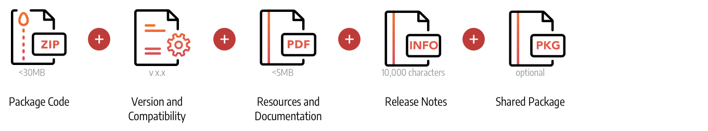
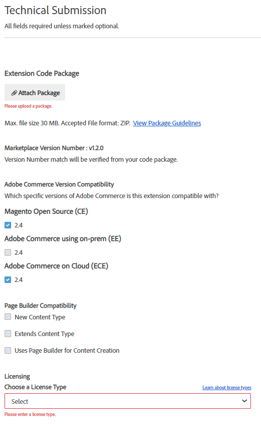
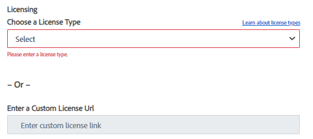
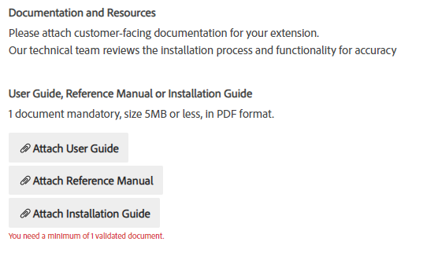
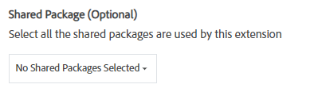
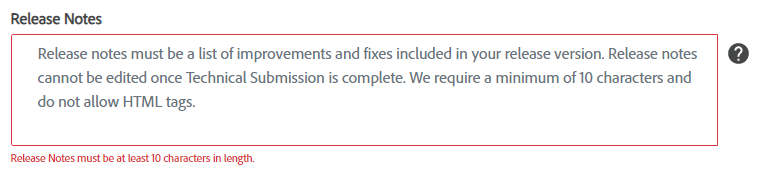
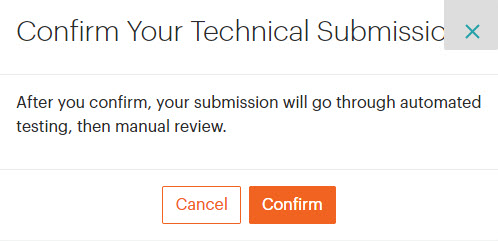

# Submit for technical review overview

All extensions submitted to Commerce Marketplace must pass the automated technical review as part of the extension submission workflow. Technical review helps to improve the quality of products on Commerce Marketplace by checking for indications of plagiarism, malware, and adherence to Magento coding standards. Developers whose extensions do not pass technical review receive a report of the results. After the issues are resolved, you are welcome to resubmit the extension. Extensions must pass technical review to receive a listing on Commerce Marketplace.

When your [extension entry](extension-information.md) is complete, you can submit your extension for technical review. During the process, we review the code according to [technical guidelines](technical-review-guidelines.md), install and use the extension according to your documentation, and verify specifics from your submission form. You can track the status and progress of your extension submission through your Marketplace account.

The following instructions show how to submit an extension for technical review. The process is essentially the same for [themes](themes.md) and [shared packages](shared-packages.md).

<InlineAlert variant="info" slots="text"/>

**Important - Shared Packages**: If your extension uses [shared packages](shared-packages.md) (or components), the packages must be ready and associated with your submission. You will not be able to submit your extension to technical review until the shared packages are available in your account.

## Prepare for technical review

Before submitting an extension or theme for marketing review, conduct your own internal review of the content to make sure that it is ready for publication.

-  Review the [technical](technical-review-guidelines.md) guidelines to ensure that your extension meets Commerce Marketplace and Magento development requirements.
-  For theme extensions, verify all image, css, and code assets correctly load on the storefront. For feature / service extensions, make sure data and options follow coding standards, logging, etc.
-  All extensions must be secure, without viruses, malware, or vulnerabilities.
-  Fully test your extension, including installation, dependencies, shared packages, configuration, and usage.

### Terms and conditions

All products and services are subject to the same Commerce Marketplace terms and conditions that are communicated to developers upon submission, and to merchants upon the purchase of any product or service. A separate licensing agreement is not required. However, you can include additional terms and conditions as follows:

-  Create a workflow that requires the merchant to accept the terms and conditions when the extension is installed.
-  Place a link to the separate agreement in the extension description.

## Step 1: Enter technical submission details

1. Log into the Marketplace Developer Portal, and then click **Extensions**.

1. Click the extension name you want to submit.

    The **Technical Submission** page loads. You can save progress and reopen this page to submit when you are ready.

1. Click **Attach Package** to upload the extension code package.

    For complete package guidelines, see [Package a component](https://developer.adobe.com/commerce/php/development/package/component/).

1. For **Magento Version Compatibility**, select the supported version number and compatibility for the extension.

    The listed options include all minor versions Magento supports at time of submission. The list is based on the release line selected at creation (M1 or M2).

    

1. Select the Licensing options.

    This option requires the user to agree to a license in addition to the Magento terms and conditions. You have two options:

    -  Choose a License Type - Select a license type provided from the drop-down menu.

    -  Enter a Custom License - Enter the name and URL location for your custom license, available from a public website.

    

1. Add Documentation and Resources for your extension.

    Commerce Marketplace tests and reviews documentation during the technical review. You can add additional documentation during the [marketing review](submit-for-marketing-review.md).

    You must include **at least one** of the following, in PDF format (less than 5MB):

    -  Attach User Guide - Documentation describing how to configure and use your extension features in the Admin and extension screens.
    -  Attach Reference Manual - Documentation detailing fields, screens, and workflows for the added features, screens, and fields in the Admin.
    -  Attach Installation Guide - Documentation instructing how to install and configure the extension on your instance.

    

1. Follow the same steps to upload a reference manual or installation guide.

1. If other components are used by an M2 extension, select the relevant **Shared Package**.

    <InlineAlert variant="info" slots="text"/>

    **Important:** Before a shared package can be linked to an extension, it must be submitted for review and receive the status **Ready to Use**.

    

1. Enter **Release Notes** for your extension.

    This preliminary draft can be formatted with simple HTML and can include text, numbers, symbols, and spaces.

    

1. When complete, submit the extension or save to continue progress later. To enter the queue, you must click **Submit**.

## Step 2: Submit the extension for technical review

1. When the required fields are complete, click **Submit**.

1. In the **Confirm Your Technical Submission** box, click **Cancel** to go back to the submission details, or click **Confirm** to submit the extension.

    It might take a few minutes for your package to upload. You will receive email confirmation when the extension is submitted for technical review, and will be notified when the review is complete.

    

## After submission

1. If you have not submitted the [marketing review](submit-for-marketing-review.md), complete those steps to submission.

1. Watch your email for feedback and updates for the technical review.

1. Check the Test Reports posted for your extension submission through the Developer portal.

1. If issues, errors, or changes are required, you will receive an email failure notification. The submission will be in a failed state. When those issues are resolved, re-submit the extension for review.

## Field descriptions

|Field|Description|
|--- |--- |
|Magento Version Compatibility|Specifies each version of Magento that is supported by the extension.|
|License Type|Identifies the license type that defines the terms of use. To learn more, see the Open Source Initiative’s Licenses by Name. Options:  **Custom License** - To use a custom license, enter the Name of the license and the License URL, where customers can read the terms of use.  **Academic Free License 3.0** - The [Academic Free License 3.0](https://opensource.org/licenses/AFL-3.0) (AFL) is an open source license that permits the free distribution and reuse of proprietary software and derivative works, provided that the source code is made available.  **Apache License 2.0** - The [Apache License](http://www.apache.org/licenses/LICENSE-2.0) 2.0 describes the terms of use, reproduction, and distribution of third-party software products that include portions of Apache software. It requires clear attribution to The Apache Software Foundation for any distributions that include Apache software.  **BSD 2-Clause License** - The [Berkeley Software Distribution 2-Clause License](https://opensource.org/licenses/BSD-2-Clause) requires the copyright notice to appear in all source code, but imposes minimal restrictions on the redistribution of open source software. The 2-clause license was derived from the original four-clause BSD license which requires a notice to appear in all advertising and prohibits the use of the contributor names in endorsements without prior written permission.  **GNU General Public License 3.0** - The [GNU General Public License 3.0](http://www.gnu.org/licenses/quick-guide-gplv3.html) (GLP-3.0) is widely used and based on the GNU open source license, and allows for the redistribution of software received from the copyright holder within the provisions outlined in the agreement. Any improved version of the software must be made available for free. To learn more, see [Frequently Asked Questions about GNU Licenses](https://www.gnu.org/licenses/gpl-faq.html#AllCompatibility).  **GNU Lesser General Public License 3.0** - The [GNU Lesser General Public License 3.0](http://www.gnu.org/licenses/lgpl-3.0.en.html) (LGPL-3.0) is widely used and based on the GNU open source license. LGPL-3.0 is somewhat less restrictive than the standard GLP-3.0, and also requires that you provide installation instructions. To learn more, see [Frequently Asked Questions about GNU Licenses](https://www.gnu.org/licenses/gpl-faq.html#AllCompatibility).  **MIT License** - The [Massachusetts Institute of Technology License](https://opensource.org/licenses/MIT) (MIT) allows for the reuse, modification, distribution, sub-licensing, and sale of proprietary software, provided that all copies include the MIT license and copyright notice.  **Mozilla Public License 1.1** - The [Mozilla Public License 1.1](https://www.mozilla.org/en-US/MPL/1.1)) (MPL-1.1) is an open source license that includes explicit patent rights and allows extensions of the code to be licensed in non-open ways. There is no requirement for a derivative work to be distributed under the same license.  **Open Software License 3.0** - The [Open Software License 3.0](https://opensource.org/licenses/OSL-3.0) (OSL-3.0) is a worldwide, royalty-free, non-exclusive license that allows sub-licensing and derivative work, provided that they are distributed under the same license.|
|Documents|Upload your customer-facing documentation in PDF format. The user guide is required, and you can optionally include a reference manual and installation guide. Maximum file size: 5 MB File type: PDF  **User Guide** - Your extension must include one user guide.  **Reference Manual** - (Optional)  **Installation Guide** - (Optional)  **_Note:_** Although the installation guide is optional, it might be required by some license types.|
|Release Notes|The preliminary Release Notes text can include simple HTML, without CSS. Maximum characters: 10,000|
|[Shared Packages](shared-packages.md)|If applicable, identifies each shared package that is required by this extension.|
