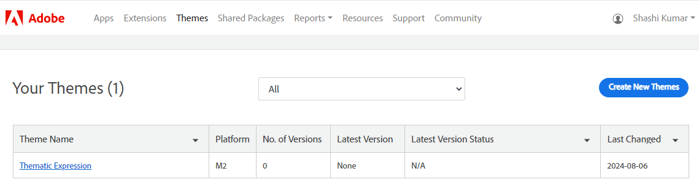

# Themes overview

A theme is a collection of files that determines the visual presentation and interactions that customers experience when they visit the store. A theme typically includes layout files, template files, CSS, and JavaScript. To learn more about theme development, see the [Frontend Developer Guide](https://developer.adobe.com/commerce/frontend-core/guide/)

The Themes tab shows the status of each theme you have submitted, and provides access to the profile and version history of each. You can also use the workspace controls to sort and filter the list.

The process to submit a theme to Commerce Marketplace is basically the same as [submitting an extension](submit-for-review.md). The only difference is that it takes place from the Themes tab.

| Column                | Description |
|-----------------------|-------------|
| Theme Name            | The name of the theme. |
| Platform              | The value of M2 indicates the app runs on Commerce 2.x. |
| No. of Versions       | The number of versions of the theme that have been created. |
| Latest Version        | The version of the theme that is currently active. |
| Latest Version Status | The current position of the theme in the submission workflow. |
| Last Changed          | The date of the last change made to the version. |
